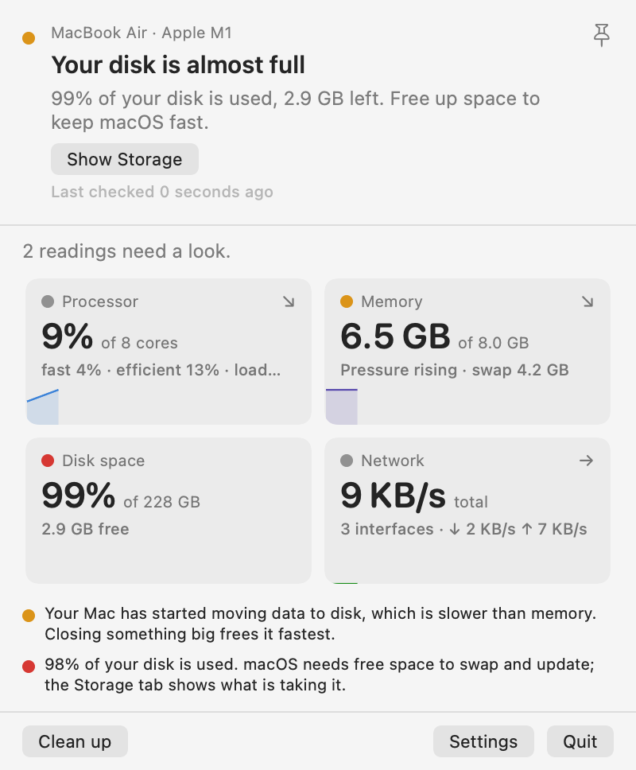
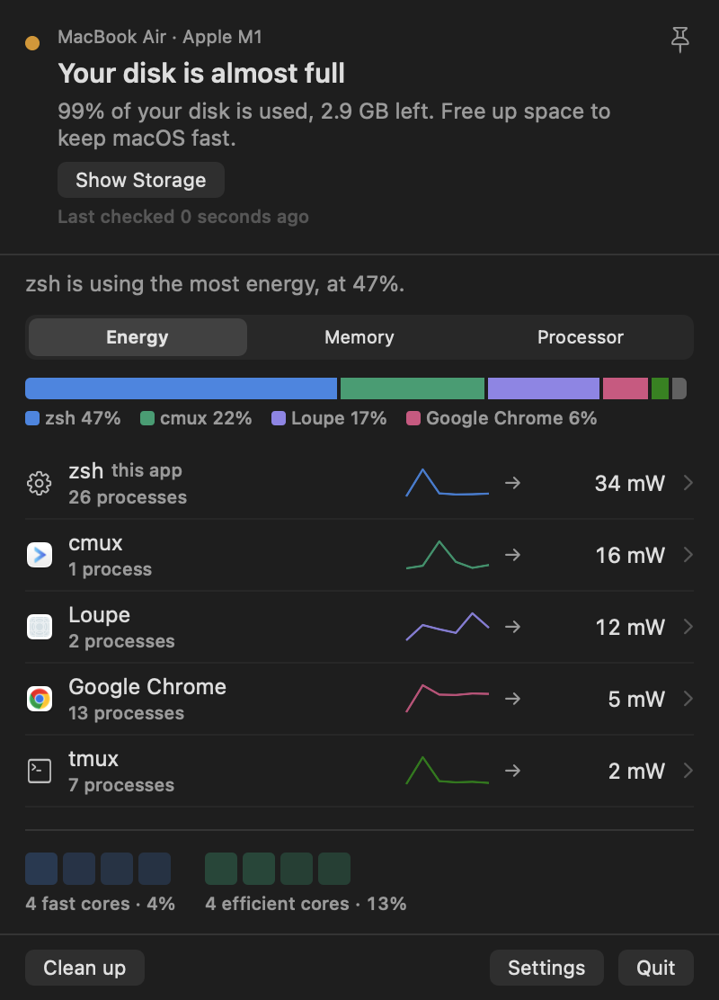

<p align="center"></p>

# Loupe

A menu bar heartbeat that tells you when something is wrong with your Mac, and a panel that tells you what.

Loupe is a native macOS status monitor: a Swift shell around a small Rust core, with the
[Mole](https://github.com/tw93/Mole) command line tool as the data and action backend.

<p align="center">


</p>

## Why

Activity Monitor shows forty numbers at equal weight, splits Chrome into forty rows, and mixes
performance and efficiency cores into one meaningless percentage. Loupe does three things instead:

- **It answers, it does not report.** One verdict sentence on top: "Your disk is almost full. 98% is
  used, 5.3 GB left." The pressure score is Mole's health score inverted, so the two tools never disagree.
- **It groups by app, not by process.** Chrome is one row with a process count. Helpers, XPC services
  and Safari's WebKit processes fold into their owner.
- **It costs nothing while closed.** With the panel closed the Mole stream is off and the core samples
  alone; the menu bar line follows your processor from the kernel's own counters.

Per-app energy comes from the kernel's nanojoule accounting (`proc_pid_rusage`), shown in watts. No root,
no helper tool, no private frameworks, no bundled binaries.

## Install

1. Download the DMG from the Releases page, or build it yourself (below).
2. Drag Loupe to Applications and launch it. It lives in the menu bar; there is no Dock icon.
3. Install Mole for the full system check, disk scans and clean-up: `brew install mole`. Loupe works
   without it, with processor, memory, disk and per-app readings only, and tells you what is missing.

Requires macOS 14 or later. Built and measured on Apple Silicon; Intel builds are universal but untested.

## What you get

| Tab | Question it answers |
|---|---|
| Overview | Is something wrong right now? Four tiles with a plain-language reason for anything flagged. |
| Apps | What is causing it? Energy, memory or processor by app, with a share bar and the fast/efficient core grid. |
| Storage | Where did my disk go? A treemap and the largest files from `mo analyze`. |
| Health | Is my Mac in good shape? Battery, temperature, uptime, memory pressure. |

The menu bar item is a fixed-width orange pulse of the last minute of processor activity. It turns red only
when the Mac is strained. Other modes (a glyph, a number, both) live in Settings.

Everything Mole-related appears only when Mole is installed. Clean-up hands off to your terminal so Mole
shows its own dry run and asks before deleting anything; Loupe never deletes files.

## Build from source

```
make            # Rust staticlib (universal) -> C header -> SwiftPM -> Loupe.app -> DMG in dist/
make test       # cargo test, the no-unwrap audit, swift test
make verify     # 60 s side-by-side with `mo status --json`, per-metric drift
make run        # build and open the app
make childtest  # quit the app and assert no orphaned Mole child
make leaktest DURATION=3600
```

You need Rust with the Apple targets (`rustup target add aarch64-apple-darwin x86_64-apple-darwin`),
`cbindgen` (only to regenerate the header), and Xcode. The Makefile uses Xcode through `DEVELOPER_DIR`
without changing `xcode-select`. Signing picks a Developer ID identity if the keychain has one, then
Apple Development, then ad-hoc; override with `SIGN_IDENTITY=-`. `make notarize NOTARY_PROFILE=<name>`
needs a Developer ID certificate and a `notarytool` keychain profile.

## Layout

```
sysmon-core/      Rust: Mole stream supervisor, rusage sampler, app rollup, history, scores, C ABI
Loupe/            SwiftPM package: menu bar item, NSPanel, SwiftUI views, settings
docs/             the specification the app was built from, screenshots
notes/            one lesson per file: measurements, corrections, decisions
```

Everything Swift knows about Mole is in `Loupe/Sources/Loupe/MoleAdapter.swift`; the Rust mirror of
Mole's snapshot is `sysmon-core/src/mole.rs`, synced to Mole 1.53.0. When Mole changes, those two files change.

## Configuration

`~/.config/loupe/panels.toml` drives the Overview tiles (the `system` panels, first four) and the Apps
metric choices (the `app` and `process` panels). Settings › Panels edits it; "Edit as text" opens it in your
editor and Loupe reloads on save. A broken file falls back to the defaults and says which line failed.

## Development notes

- `LOUPE_DEBUG=1` prints stream state and self-cost per poll to stderr when the binary is run directly.
- `LOUPE_RENDER=<dir>` with `LOUPE_OPEN_PANEL=1` renders every tab to PNG offscreen and quits.
- `cargo run --release --bin dump` prints the current app rollup; `--bin rank` compares the energy ordering
  with Apple's `top -o power`.
- Measured facts and the reasons behind design decisions live in `notes/`. Start with
  `notes/spec-deviations.md` and `notes/q5-cadence.md`.

## Known limits

- Root and other users' processes cannot be sampled without a private entitlement; those rows carry Mole's
  `ps` figure marked with an approximation sign.
- With the panel open, Mole's own process tree costs a few percent of a core; that is Mole's cost, not
  Loupe's, and it stops when the panel closes.
- On macOS 26 Mole reports an empty memory pressure level because the `memory_pressure` tool no longer
  prints one; Loupe fills the display from the kernel's own level.

## Credits and licence

Loupe is MIT licensed. System metrics, the health score and disk analysis come from Mole by tw93, licensed
GPL-3.0; Loupe runs the `mo` binary as a separate process over a pipe and does not include or modify it.
